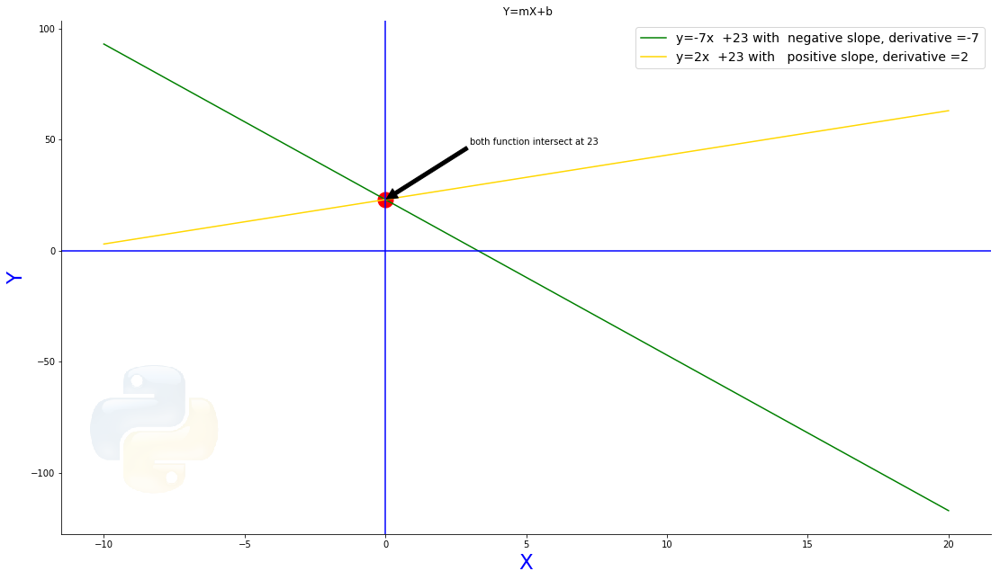
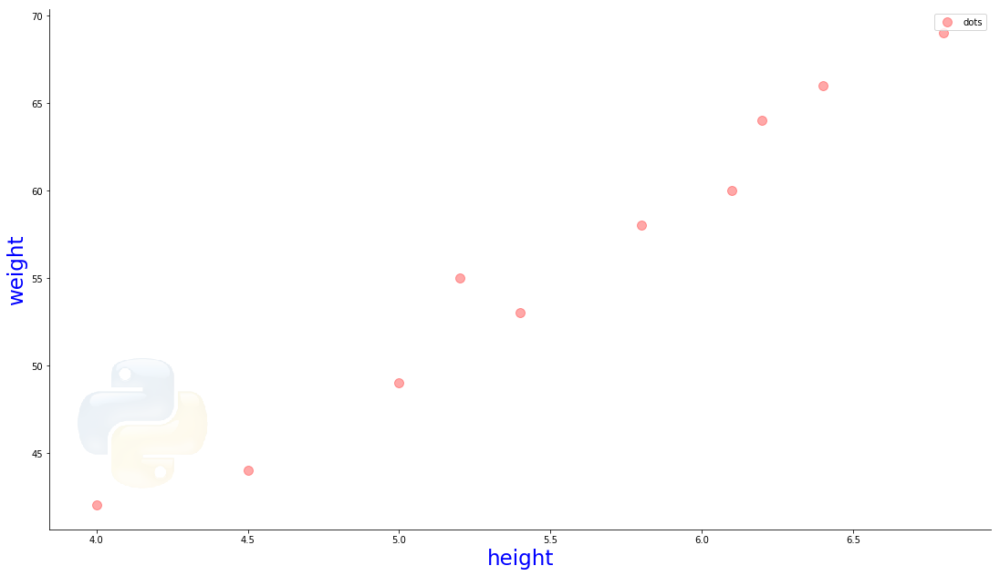
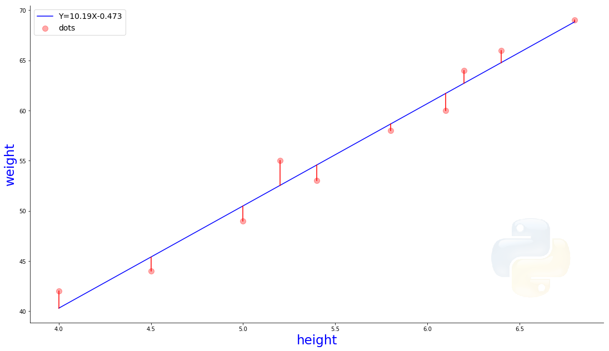
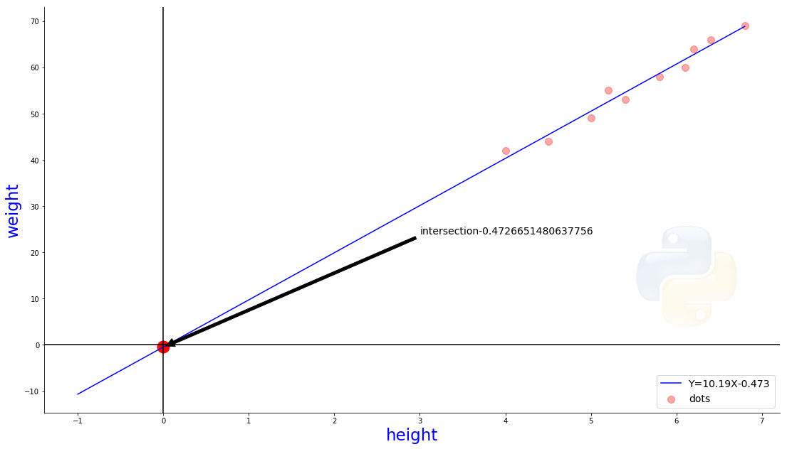
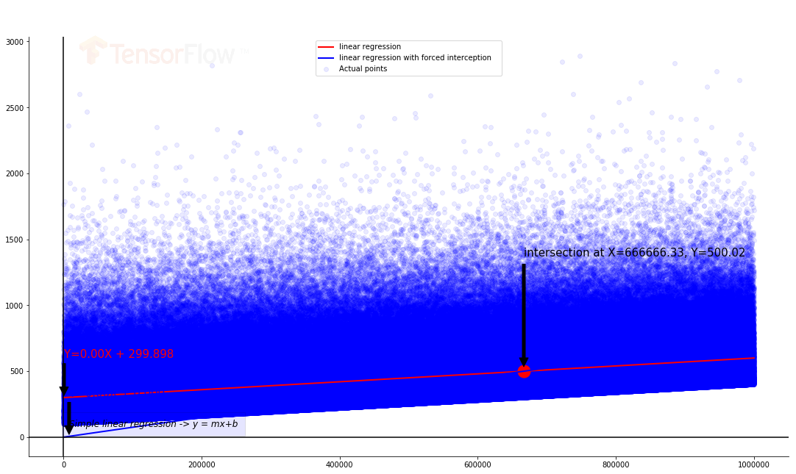
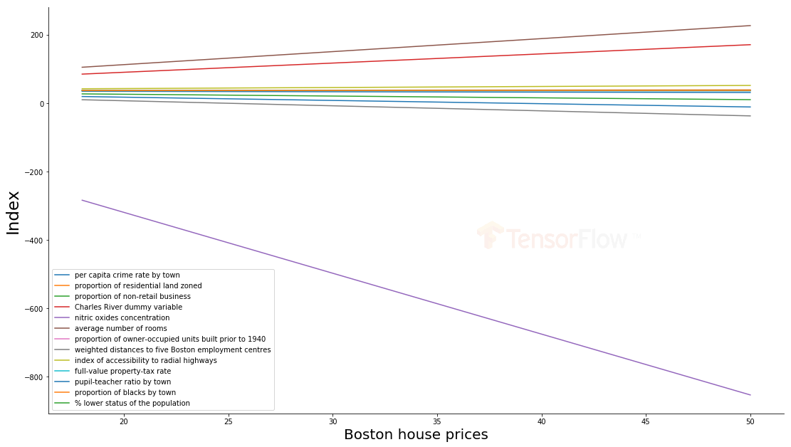
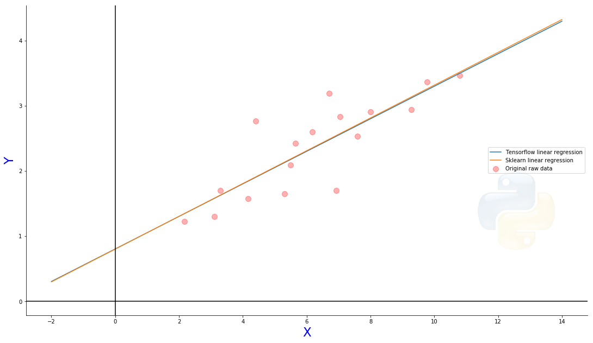
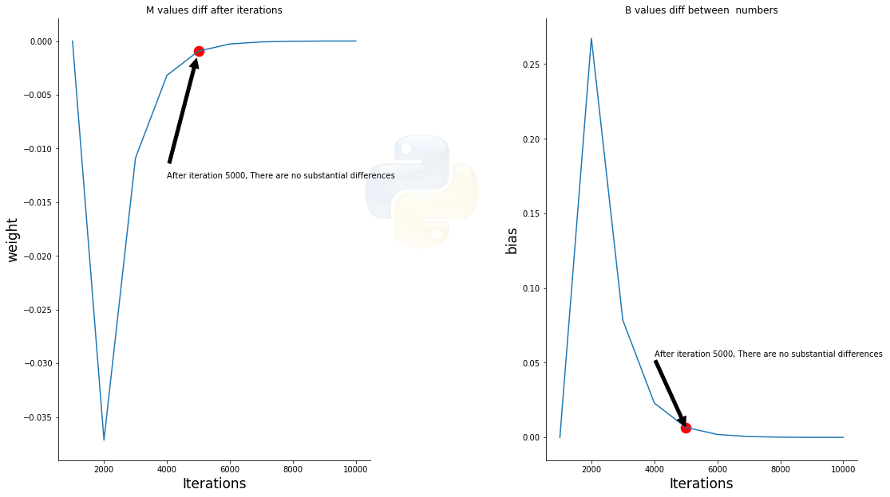
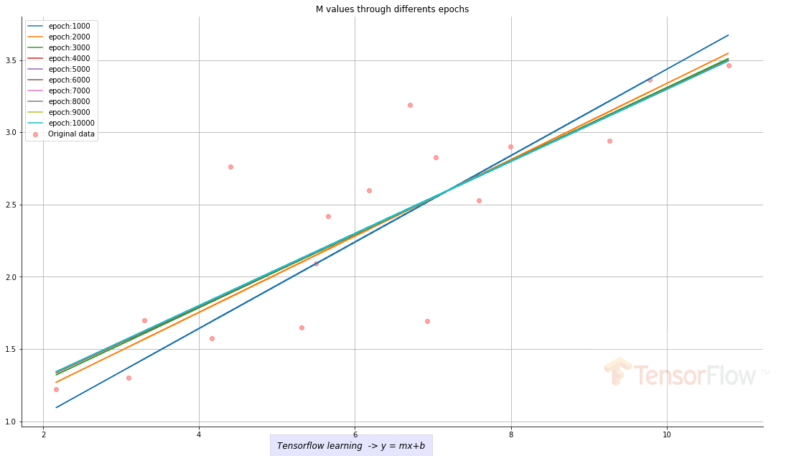

<hr><hr>
<hr>
# Linear regression from  simple  math to Artificial Intelligence.

<hr>
<hr>

# From zero to hero
<hr>
**Author:** Gregorio Flores
<hr>
<hr>

TODO: FINISH DOCUMENTATION
<hr>
TODO: Versión en español
<hr>
TODO: Version Française

---

**Review:** Gregorio Flores
<hr>
---

Before you start

<pre>
pip install sklearn pandas numpy  tensorflow py-common-fetch
</pre>


First of all, we have to understand what is a linear function and how to create a nice chart using maplotlib 

<hr>

# This is the well know function

## f(x)=mx+b ## 

<hr>

The linear function is defined  as a polynomial function in which the variable x has slope
Such a function is called linear because its graph, the set of all points {\displaystyle (x,f(x))} (x,f(x)) in the Cartesian plane, is a line. The coefficient (m) a is called the slope of the function and of the line.

If the slope is {M} this is a constant function {\displaystyle f(x)=b} {\displaystyle f(x)=b} defining a horizontal line, which some authors exclude from the class of linear function. With this definition, the degree of a linear polynomial would be exactly one, its graph a diagonal line neither vertical nor horizontal. 

<hr>

** Let's code
---


```python
import matplotlib.pyplot as plt


m1=-7
m2=2
intersect = 23

r =np.arange(-10,21)

yy=r*m1+intersect
yy2=r*m2+intersect

plt.plot(r,yy,label='y='+str(m1)+'x  +'+str(intersect)+' with  negative slope, derivative ='+str(m1),color='green')
plt.plot(r,yy2,label='y='+str(m2)+'x  +'+str(intersect)+' with   positive slope, derivative ='+str(m2),color='gold')
plt.xlabel('X', fontsize=23, color='blue')
plt.ylabel('Y', fontsize=23, color='blue')
plt.axhline(0, color='blue')
plt.axvline(0, color='blue')


plt.scatter(0,intercept,s=290,c='r') # The red dot

plt.title(' Y=mX+b')


plt.legend(fontsize=14)
fig =plt.gcf()

fig.set_size_inches(18.5, 10.5)

plt.annotate('both function intersect at '+str(intersect), xy=(0,intercept ), xytext=(3, intercept+24),
            arrowprops=dict(facecolor='black', shrink=0.01),verticalalignment='bottom')

ax = plt.gca()

ax.spines['right'].set_visible(False)
ax.spines['top'].set_visible(False)

img= plt.imread('python3d.png') #backgroubd logo

ax = plt.axes([0.103,0.18 ,0.2, 0.2], frameon=True)  # Change the numbers in this array to position your image [left, bottom, width, height])
ax.imshow(img,alpha=0.092)
ax.axis('off') 


plt.show()


```





# Derivative

<hr>

The derivative of a function  measures the sensitivity to change of the function value


<hr>

The green line plots y=-7x +23 **Where derivative is -7**

The gold line plots y=2x +23 **Where derivative is 2**


**Both derivatives measures the sensitive of change** 

<hr>


# Is Time to go back 

<hr>

Let work with  a very simple linear regression 

<hr>

**What is a linear regression?**

In statistics, linear regression is a linear approach to modelling the relationship between numbers.. Commonly  a series data. 

<hr>
lets create an array of Y and X

        1 Print values
        2 Plot the values


```python
height=[[4.0],[4.5],[5.0],[5.2],[5.4],[5.8],[6.1],[6.2],[6.4],[6.8]]
weight=[  42 ,  44 , 49, 55  , 53  , 58   , 60  , 64  ,  66 ,  69]
print('height weight')

for row in zip(height, weight):
    print(row[0],':->',row[1])

    


```

    height weight
    [4.0] :-> 42
    [4.5] :-> 44
    [5.0] :-> 49
    [5.2] :-> 55
    [5.4] :-> 53
    [5.8] :-> 58
    [6.1] :-> 60
    [6.2] :-> 64
    [6.4] :-> 66
    [6.8] :-> 69


```python


plt.scatter(height,weight,color='red',s=100,label='dots',alpha=.34) # plot the dots
plt.xlabel('height', fontsize=23, color='blue')
plt.ylabel('weight', fontsize=23, color='blue')
plt.legend()
fig =plt.gcf()
fig.set_size_inches(18.5, 10.5)
ax = plt.gca()

ax.spines['right'].set_visible(False)
ax.spines['top'].set_visible(False)

img= plt.imread('python3d.png') #backgroubd logo

ax = plt.axes([0.103,0.18 ,0.2, 0.2], frameon=True)  # Change the numbers in this array to position your image [left, bottom, width, height])
ax.imshow(img,alpha=0.092)
ax.axis('off') 

plt.show()

```





---
----


Now is time to create a great math model using sklearn

---
**lets code**

---


```python
from sklearn import linear_model
from sklearn.metrics import mean_squared_error
from sklearn.metrics import r2_score
from termcolor import colored


reg=linear_model.LinearRegression()
reg.fit(height,weight)

m=reg.coef_[0]
b=reg.intercept_


predicted_weight = [reg.coef_ * i + reg.intercept_ for i in height]
msr=mean_squared_error(weight,predicted_weight)
variance= r2_score(weight,predicted_weight)

print(colored('_'*60,'red'))
print('slope=',m, 'intercept=',b)
print(colored('_'*60,'red'))
print('mean squared error=',msr)
print(colored('_'*60,'red'))
print('variance',variance)
print(colored('_'*60,'red'))
print()
print()


```

    ____________________________________________________________
    slope= 10.193621867881548 intercept= -0.4726651480637756
    ____________________________________________________________
    mean squared error= 2.2136674259681084
    ____________________________________________________________
    variance 0.9705629331653177
    ____________________________________________________________
    
    


<hr>
<hr>
**At this moment we have everything that we need**

**the slope:** (m) "sensitivity to change" an  the interception
<hr>
**mean squared error or MSE:** Thats measures the average of the squares of the errors or deviations. The difference 
between the estimator and what is estimated.
<hr>
**Variance:** , is the proportion of the variance in the dependent variable that is predictable from the independent variable(s).. Close to 1 is better 
<hr>

**let's plot the function**

<hr>


```python


legend = 'Y={0:.2f}X{1:.3f}'.format(reg.coef_ [0],reg.intercept_)
plt.scatter(height,weight,color='red',s=100,label='dots',alpha=.34) #plot ths dots 
plt.plot(height, predicted_weight, 'b',label=legend) #plot the line
plt.xlabel('height', fontsize=23, color='blue')
plt.ylabel('weight', fontsize=23, color='blue')

plt.legend(fontsize=14)
fig =plt.gcf()
fig.set_size_inches(18.5, 10.5)
ax = plt.gca()

ax.spines['right'].set_visible(False)
ax.spines['top'].set_visible(False)

img= plt.imread('python3d.png') #backgroubd logo

ax = plt.axes([0.703,0.18 ,0.2, 0.2], frameon=True)  
ax.imshow(img,alpha=0.092)
ax.axis('off') 

plt.show()


```


<hr>
---

# Now is time to plot the distance between our model and raw he data

---
**let's code**

---

<hr>


```python

for row in zip(height, weight, predicted_weight):
    print('height',row[0],'raw:->',row[1],'predicted:->',row[2])
    
print('-'*60)


```

    height [4.0] raw:-> 42 predicted:-> [40.30182232]
    height [4.5] raw:-> 44 predicted:-> [45.39863326]
    height [5.0] raw:-> 49 predicted:-> [50.49544419]
    height [5.2] raw:-> 55 predicted:-> [52.53416856]
    height [5.4] raw:-> 53 predicted:-> [54.57289294]
    height [5.8] raw:-> 58 predicted:-> [58.65034169]
    height [6.1] raw:-> 60 predicted:-> [61.70842825]
    height [6.2] raw:-> 64 predicted:-> [62.72779043]
    height [6.4] raw:-> 66 predicted:-> [64.76651481]
    height [6.8] raw:-> 69 predicted:-> [68.84396355]
    ------------------------------------------------------------


```python

legend = 'Y={0:.2f}X{1:.3f}'.format(reg.coef_ [0],reg.intercept_)
plt.scatter(height,weight,color='red',s=100,label='dots',alpha=.34) #plot the dots 
plt.plot(height, predicted_weight, 'b',label=legend) #plot the line


i=0
for d in predicted_weight:

    plt.plot([height[i],height[i]], [weight[i],weight[i]-(weight[i]-d)], 'r-') # plot the distance
    i+=1 


    
plt.xlabel('height', fontsize=23, color='blue')
plt.ylabel('weight', fontsize=23, color='blue')

plt.legend(fontsize=14)
fig =plt.gcf()
fig.set_size_inches(18.5, 10.5)
ax = plt.gca()

ax.spines['right'].set_visible(False)
ax.spines['top'].set_visible(False)

img= plt.imread('python3d.png') #background logo

ax = plt.axes([0.703,0.18 ,0.2, 0.2], frameon=True)  
ax.imshow(img,alpha=0.092)
ax.axis('off') 

plt.show()


```





<hr>
---

**Right now our math model looks almost perfect.**
<hr>

Right now  we are not hable to see the intersection.
<hr>

**Let's code**

    1. insert -1 at beginning
    2. plot the new array 

<hr>


```python
import copy


height2 = copy.deepcopy(height)
height2.insert(0,[-1]) # we need add a new point @ axis X

predicted_weight2 = [reg.coef_ * i + reg.intercept_ for i in height2]

plt.scatter(height,weight,color='red',s=100,label='dots',alpha=.34)
plt.xlabel('height', fontsize=23, color='blue')
plt.ylabel('weight', fontsize=23, color='blue')
plt.plot(height2, predicted_weight2, 'b',label=legend)
plt.legend(loc=4,fontsize=14)
plt.axhline(0, color='black')
plt.axvline(0, color='black')
ax = plt.gca()

ax.spines['right'].set_visible(False)
ax.spines['top'].set_visible(False)

fig =plt.gcf()
fig.set_size_inches(18.5, 10.5)
plt.scatter(0,b,s=290,c='r')
plt.annotate('intersection'+str(b), xy=(0,b ), xytext=(3, b+24),fontsize=14,
            arrowprops=dict(facecolor='black', shrink=0.01),verticalalignment='bottom')


ax = plt.axes([0.703,0.28 ,0.2, 0.2], frameon=True)  
ax.imshow(img,alpha=0.092)
ax.axis('off') 
plt.show()


```





<hr>

---

As we can see our model looks well.

<hr>

---


<hr>
# Lets work with some complex Big Data
<hr>

    1. create a 1,000,000 data array
    2. add exponencial noise
    3. create two models
    4. model 1 does not force interception @ (0,0)
    5. model 2 force interception @ (0,0)
    6. plot
    7. compare
    
<hr>
    
    
    
    
    


```python

universe = 1000000
noise = 200

X = np.arange(universe).reshape(-1,1)
Y = np.linspace(100,400,universe)+np.random.exponential(noise, universe)


reg = linear_model.LinearRegression(fit_intercept=True)# force interception @0,0
reg2 = linear_model.LinearRegression(fit_intercept=False)

reg.fit(X,Y)
reg2.fit(X,Y)


m=reg.coef_[0]
b=reg.intercept_

m2=reg2.coef_[0]
b2=reg2.intercept_

predicted_values = reg.predict(X)
predicted_values2 = reg2.predict(X)


plt.scatter(X, Y, label='Actual points', c='b',alpha=0.083)
plt.plot(X,predicted_values,'r',label='linear regression ',linewidth=2.0)
plt.plot(X,predicted_values2,'b',label='linear regression with forced interception   ',linewidth=2.0)


plt.axhline(0, color='black')
plt.axvline(0, color='black')


plt.legend()

#coordenadas con interception
legend = 'Y={0:.2f}X + {1:.3f}'.format(reg.coef_ [0],reg.intercept_)
legend2 = 'Y={0:.2f}X + {1:.3f}'.format(reg2.coef_ [0],reg2.intercept_)

x1=X[600][0]
y1=x1*reg.coef_ + reg.intercept_ 

x2=X[8000][0]
y2=x2*reg2.coef_ + reg2.intercept_ 

#lets do the math to find the intersection
y_intersection = b/(1-m/m2)
x_intersection = y_intersection/m2


intersection_label = 'intersection at X={0:.2f}, Y={1:.2f}'.format(x_intersection,y_intersection)


plt.scatter(x_intersection,y_intersection,s=290,c='r')

plt.annotate(intersection_label, xy=(x_intersection,y_intersection ), xytext=(x_intersection, y_intersection+940),
            arrowprops=dict(facecolor='black', shrink=0.04),verticalalignment='top', fontsize=15)


plt.text(7630, 80, 'Simple linear regression -> y = mx+b', style='italic', fontsize=12,
        bbox={'facecolor':'blue', 'alpha':0.1, 'pad':10})


plt.annotate(legend, xy=(x1, y1), xytext=(x1+100, y1+300), fontsize=15, color='r',
            arrowprops=dict(facecolor='black', shrink=0.05))

plt.annotate(legend2, xy=(x2, y2), xytext=(x2+100, y2+300), fontsize=15, color='b',
            arrowprops=dict(facecolor='black', shrink=0.05))

ax = plt.gca()

ax.spines['right'].set_visible(False)
ax.spines['top'].set_visible(False)

fig =plt.gcf()
fig.set_size_inches(18.5, 10.5)

ax = plt.axes([0.16203,0.75 ,0.2, 0.2], frameon=True)  # Change the numbers in this array to position your image [left, bottom, width, height])
ax.imshow(img,alpha=0.092)
ax.axis('off') 


plt.show()


```





<hr>
<hr>
**What is the best model?**

<hr>


```python

# lets code

msr=mean_squared_error(Y,predicted_values)
variance= r2_score(Y,predicted_values)

msr2=mean_squared_error(Y,predicted_values2)
variance2= r2_score(Y,predicted_values2)

print(colored('_'*60,'red'))
print(colored('Model 1=','magenta'),legend)
print(colored('_'*60,'red'))
print(colored('mean squared error=','magenta'),msr)
print(colored('_'*60,'red'))
print(colored('variance','magenta'),variance)
      
print(colored('_'*60,'red'))
print(colored('Model 2=','magenta'),legend2)
print(colored('_'*60,'red'))
print(colored('mean squared error=','magenta'),msr2)
print(colored('_'*60,'red'))
print(colored('variance','magenta'),variance2)
print()
print()
```

    ____________________________________________________________
    Model 1= Y=0.00X + 300.588
    ____________________________________________________________
    mean squared error= 40610.819076079155
    ____________________________________________________________
    variance 0.1569505369169052
    ____________________________________________________________
    Model 2= Y=0.01X + 0.000
    ____________________________________________________________
    mean squared error= 63199.39861690999
    ____________________________________________________________
    variance -0.31197105311633355
    
    


<hr>

<hr>

#  Let's work with multiple linear regressions.

<hr>
    1. Import pandas
    2. load  Boston House Prices dataset 
    3. extract price

<hr>
**Let's code**

<hr>


```python
import pandas as pd

from sklearn.datasets import load_boston

boston=load_boston()#import
bos = pd.DataFrame(boston.data)
bos.columns= boston.feature_names
bos['PRICE'] = boston.target

```


```python
bos.head(5)


```


<div>
<style scoped>
    .dataframe tbody tr th:only-of-type {
        vertical-align: middle;
    }

    .dataframe tbody tr th {
        vertical-align: top;
    }

    .dataframe thead th {
        text-align: right;
    }
</style>
<table border="1" class="dataframe">
  <thead>
    <tr style="text-align: right;">
      <th></th>
      <th>CRIM</th>
      <th>ZN</th>
      <th>INDUS</th>
      <th>CHAS</th>
      <th>NOX</th>
      <th>RM</th>
      <th>AGE</th>
      <th>DIS</th>
      <th>RAD</th>
      <th>TAX</th>
      <th>PTRATIO</th>
      <th>B</th>
      <th>LSTAT</th>
      <th>PRICE</th>
    </tr>
  </thead>
  <tbody>
    <tr>
      <th>0</th>
      <td>0.00632</td>
      <td>18.0</td>
      <td>2.31</td>
      <td>0.0</td>
      <td>0.538</td>
      <td>6.575</td>
      <td>65.2</td>
      <td>4.0900</td>
      <td>1.0</td>
      <td>296.0</td>
      <td>15.3</td>
      <td>396.90</td>
      <td>4.98</td>
      <td>24.0</td>
    </tr>
    <tr>
      <th>1</th>
      <td>0.02731</td>
      <td>0.0</td>
      <td>7.07</td>
      <td>0.0</td>
      <td>0.469</td>
      <td>6.421</td>
      <td>78.9</td>
      <td>4.9671</td>
      <td>2.0</td>
      <td>242.0</td>
      <td>17.8</td>
      <td>396.90</td>
      <td>9.14</td>
      <td>21.6</td>
    </tr>
    <tr>
      <th>2</th>
      <td>0.02729</td>
      <td>0.0</td>
      <td>7.07</td>
      <td>0.0</td>
      <td>0.469</td>
      <td>7.185</td>
      <td>61.1</td>
      <td>4.9671</td>
      <td>2.0</td>
      <td>242.0</td>
      <td>17.8</td>
      <td>392.83</td>
      <td>4.03</td>
      <td>34.7</td>
    </tr>
    <tr>
      <th>3</th>
      <td>0.03237</td>
      <td>0.0</td>
      <td>2.18</td>
      <td>0.0</td>
      <td>0.458</td>
      <td>6.998</td>
      <td>45.8</td>
      <td>6.0622</td>
      <td>3.0</td>
      <td>222.0</td>
      <td>18.7</td>
      <td>394.63</td>
      <td>2.94</td>
      <td>33.4</td>
    </tr>
    <tr>
      <th>4</th>
      <td>0.06905</td>
      <td>0.0</td>
      <td>2.18</td>
      <td>0.0</td>
      <td>0.458</td>
      <td>7.147</td>
      <td>54.2</td>
      <td>6.0622</td>
      <td>3.0</td>
      <td>222.0</td>
      <td>18.7</td>
      <td>396.90</td>
      <td>5.33</td>
      <td>36.2</td>
    </tr>
  </tbody>
</table>
</div>


```python
X = bos.drop('PRICE',axis=1)
X.head(5)


```


<div>
<style scoped>
    .dataframe tbody tr th:only-of-type {
        vertical-align: middle;
    }

    .dataframe tbody tr th {
        vertical-align: top;
    }

    .dataframe thead th {
        text-align: right;
    }
</style>
<table border="1" class="dataframe">
  <thead>
    <tr style="text-align: right;">
      <th></th>
      <th>CRIM</th>
      <th>ZN</th>
      <th>INDUS</th>
      <th>CHAS</th>
      <th>NOX</th>
      <th>RM</th>
      <th>AGE</th>
      <th>DIS</th>
      <th>RAD</th>
      <th>TAX</th>
      <th>PTRATIO</th>
      <th>B</th>
      <th>LSTAT</th>
    </tr>
  </thead>
  <tbody>
    <tr>
      <th>0</th>
      <td>0.00632</td>
      <td>18.0</td>
      <td>2.31</td>
      <td>0.0</td>
      <td>0.538</td>
      <td>6.575</td>
      <td>65.2</td>
      <td>4.0900</td>
      <td>1.0</td>
      <td>296.0</td>
      <td>15.3</td>
      <td>396.90</td>
      <td>4.98</td>
    </tr>
    <tr>
      <th>1</th>
      <td>0.02731</td>
      <td>0.0</td>
      <td>7.07</td>
      <td>0.0</td>
      <td>0.469</td>
      <td>6.421</td>
      <td>78.9</td>
      <td>4.9671</td>
      <td>2.0</td>
      <td>242.0</td>
      <td>17.8</td>
      <td>396.90</td>
      <td>9.14</td>
    </tr>
    <tr>
      <th>2</th>
      <td>0.02729</td>
      <td>0.0</td>
      <td>7.07</td>
      <td>0.0</td>
      <td>0.469</td>
      <td>7.185</td>
      <td>61.1</td>
      <td>4.9671</td>
      <td>2.0</td>
      <td>242.0</td>
      <td>17.8</td>
      <td>392.83</td>
      <td>4.03</td>
    </tr>
    <tr>
      <th>3</th>
      <td>0.03237</td>
      <td>0.0</td>
      <td>2.18</td>
      <td>0.0</td>
      <td>0.458</td>
      <td>6.998</td>
      <td>45.8</td>
      <td>6.0622</td>
      <td>3.0</td>
      <td>222.0</td>
      <td>18.7</td>
      <td>394.63</td>
      <td>2.94</td>
    </tr>
    <tr>
      <th>4</th>
      <td>0.06905</td>
      <td>0.0</td>
      <td>2.18</td>
      <td>0.0</td>
      <td>0.458</td>
      <td>7.147</td>
      <td>54.2</td>
      <td>6.0622</td>
      <td>3.0</td>
      <td>222.0</td>
      <td>18.7</td>
      <td>396.90</td>
      <td>5.33</td>
    </tr>
  </tbody>
</table>
</div>


```python

lm = linear_model.LinearRegression()
_ = lm.fit(X, bos.PRICE) #here is the magic 
description = ['per capita crime rate by town','proportion of residential land zoned','proportion of non-retail business','Charles River dummy variable','nitric oxides concentration','average number of rooms','proportion of owner-occupied units built prior to 1940','weighted distances to five Boston employment centres','index of accessibility to radial highways','full-value property-tax rate','pupil-teacher ratio by town','proportion of blacks by town','% lower status of the population','Median value of owner-occupied']
lm.intercept_
dataframe = pd.DataFrame(list(zip(bos.columns,lm.coef_,np.full((len(lm.coef_)), lm.intercept_),description)),columns=['features','estimated_coeffcients','interception','description'])

#We create a new object with all coeffients... Now ist time to plot
dataframe


```


<div>
<style scoped>
    .dataframe tbody tr th:only-of-type {
        vertical-align: middle;
    }

    .dataframe tbody tr th {
        vertical-align: top;
    }

    .dataframe thead th {
        text-align: right;
    }
</style>
<table border="1" class="dataframe">
  <thead>
    <tr style="text-align: right;">
      <th></th>
      <th>features</th>
      <th>estimated_coeffcients</th>
      <th>interception</th>
      <th>description</th>
    </tr>
  </thead>
  <tbody>
    <tr>
      <th>0</th>
      <td>CRIM</td>
      <td>-0.107171</td>
      <td>36.491103</td>
      <td>per capita crime rate by town</td>
    </tr>
    <tr>
      <th>1</th>
      <td>ZN</td>
      <td>0.046395</td>
      <td>36.491103</td>
      <td>proportion of residential land zoned</td>
    </tr>
    <tr>
      <th>2</th>
      <td>INDUS</td>
      <td>0.020860</td>
      <td>36.491103</td>
      <td>proportion of non-retail business</td>
    </tr>
    <tr>
      <th>3</th>
      <td>CHAS</td>
      <td>2.688561</td>
      <td>36.491103</td>
      <td>Charles River dummy variable</td>
    </tr>
    <tr>
      <th>4</th>
      <td>NOX</td>
      <td>-17.795759</td>
      <td>36.491103</td>
      <td>nitric oxides concentration</td>
    </tr>
    <tr>
      <th>5</th>
      <td>RM</td>
      <td>3.804752</td>
      <td>36.491103</td>
      <td>average number of rooms</td>
    </tr>
    <tr>
      <th>6</th>
      <td>AGE</td>
      <td>0.000751</td>
      <td>36.491103</td>
      <td>proportion of owner-occupied units built prior...</td>
    </tr>
    <tr>
      <th>7</th>
      <td>DIS</td>
      <td>-1.475759</td>
      <td>36.491103</td>
      <td>weighted distances to five Boston employment c...</td>
    </tr>
    <tr>
      <th>8</th>
      <td>RAD</td>
      <td>0.305655</td>
      <td>36.491103</td>
      <td>index of accessibility to radial highways</td>
    </tr>
    <tr>
      <th>9</th>
      <td>TAX</td>
      <td>-0.012329</td>
      <td>36.491103</td>
      <td>full-value property-tax rate</td>
    </tr>
    <tr>
      <th>10</th>
      <td>PTRATIO</td>
      <td>-0.953464</td>
      <td>36.491103</td>
      <td>pupil-teacher ratio by town</td>
    </tr>
    <tr>
      <th>11</th>
      <td>B</td>
      <td>0.009393</td>
      <td>36.491103</td>
      <td>proportion of blacks by town</td>
    </tr>
    <tr>
      <th>12</th>
      <td>LSTAT</td>
      <td>-0.525467</td>
      <td>36.491103</td>
      <td>% lower status of the population</td>
    </tr>
  </tbody>
</table>
</div>


<hr>
<hr>
# VOILA Now we have all values from the linear regression in a new dataset
<hr>
<hr>

**Let's code**
<hr>


```python
X_boston_price = range(18,51)

for i in range(len(dataframe)):
    plt.plot(X_boston_price,X_boston_price*dataframe.estimated_coeffcients[i]+dataframe.interception[i],label=dataframe.description[i])
    

plt.legend()
plt.xlabel('Boston house prices', fontsize=20, color='black')
plt.ylabel('Index', fontsize=23, color='black')

ax = plt.gca()

ax.spines['right'].set_visible(False)
ax.spines['top'].set_visible(False)

fig =plt.gcf()
fig.set_size_inches(18.5, 10.5)
ax = plt.axes([0.56203,0.35 ,0.2, 0.2], frameon=True)  # Change the numbers in this array to position your image [left, bottom, width, height])
ax.imshow(img,alpha=0.092)
ax.axis('off') 

plt.show()

```





<hr>
<hr>

# ARTIFICIAL INTELIGENCE

<hr>
**Finally we are going to use tensorflow**


<hr>


---
---

    1. create  numpy arrays (train X & Y)
    2. create placeholder (how tensorflow store data)
    3. create model variables where m=weight & b=biad 
    4. construct a linear model y=mx+b
    5. reduce reduce de mean squared error
    6. define the optimizer
    7. initialize tensorflow 
  
---


```python

import warnings

warnings.simplefilter(action='ignore', category=FutureWarning)
import tensorflow as tf


rng = np.random
# Parameters
learning_rate = 0.01
training_epochs = 10000
display_step = 1000

# 1
train_X = np.asarray([3.3,4.4,5.5,6.71,6.93,4.168,9.779,6.182,7.59,2.167,
                         7.042,10.791,5.313,7.997,5.654,9.27,3.1])
train_Y = np.asarray([1.7,2.76,2.09,3.19,1.694,1.573,3.366,2.596,2.53,1.221,
                         2.827,3.465,1.65,2.904,2.42,2.94,1.3])


n_samples = len(train_Y)

#2 

# tf Graph Input
X = tf.placeholder('float')
Y = tf.placeholder('float')

# 3
W = tf.Variable(rng.randn(), name='weight')
b = tf.Variable(rng.randn(), name='bias')


# 4
pred = tf.add(tf.multiply(X, W), b) # y=mx+b

# 5
cost = tf.reduce_sum(tf.pow(pred-Y, 2))/(2*n_samples)# we want to reduce MSE

#6
optimizer = tf.train.GradientDescentOptimizer(learning_rate).minimize(cost)
#7
init = tf.global_variables_initializer()


```

---
___

***let's see how this stuff  works**


____


```python
from aniachi.stringUtils import showAdvance

# Start training
with tf.Session() as sess:

    # Run the initializer
    sess.run(init)
    mw=[]
    bs=[]
    el=[]

    # Fit all training data
    for epoch in range(training_epochs):
        for (x, y) in zip(train_X, train_Y):
            sess.run(optimizer, feed_dict={X: x, Y: y})

        # save  logs per epoch step every 1000 interations
        
        if (epoch+1) % display_step == 0:
            c = sess.run(cost, feed_dict={X: train_X, Y:train_Y})
            showAdvance(i=epoch+1,total=training_epochs,msg='Working')

            mw.append(sess.run(W)) # we save the value for two reasons. 1. we can not get the value when session is closed. 
            bs.append(sess.run(b)) # 2. we save the values to plot them
            el.append('epoch:'+str(epoch+1))
            

    print('Optimization Done!')

    training_cost = sess.run(cost, feed_dict={X: train_X, Y: train_Y})
    #Print the  function
    print('Y={0:.4f}X +{1:.3f}'.format(sess.run(W),sess.run(b)))
 


```

    Optimization Done! Working
    Y=0.2496X +0.801


```python


from termcolor import colored
reg=linear_model.LinearRegression()
reg.fit(train_X.reshape(-1,1),train_Y)
print(colored('_'*60,'red'))
print('sklearn Linear regression ')
print(colored('_'*60,'red'))
print(colored('M value:','green'),  reg.coef_[0])
print(colored('B value:','green'),  reg.intercept_)
print(colored('function:','green'),  'Y={0:.4f}X +{1:.3f}'.format(reg.coef_ [0],reg.intercept_))
print(colored('_'*60,'red'))
print('Tensorflow Linear regression ')
print(colored('_'*60,'red'))
print(colored('M value:','green'),  mw[-1])# the last value
print(colored('B value:','green'),  bs[-1])# the last value
print(colored('function:','green'),  'Y={0:.4f}X +{1:.3f}'.format(mw[-1],bs[-1]))
print(colored('_'*60,'red'))


```

    ____________________________________________________________
    sklearn Linear regression 
    ____________________________________________________________
    M value: 0.25163494428355404
    B value: 0.7988012261753894
    function: Y=0.2516X +0.799
    ____________________________________________________________
    Tensorflow Linear regression 
    ____________________________________________________________
    M value: 0.24960834
    B value: 0.80136055
    function: Y=0.2496X +0.801
    ____________________________________________________________


```python


xxx = range(-2,15)

plt.scatter(train_X,train_Y,color='red',s=100,label='Original raw data',alpha=.31)
plt.plot(xxx, xxx*mw[-1] +bs[-1],label='Tensorflow linear regression')
plt.plot(xxx, xxx*reg.coef_[0]+reg.intercept_,label='Sklearn linear regression')
plt.legend()
plt.xlabel('X', fontsize=23, color='blue')
plt.ylabel('Y', fontsize=23, color='blue')
plt.axhline(0, color='black')
plt.axvline(0, color='black')
ax = plt.gca()
ax.spines['right'].set_visible(False)
ax.spines['top'].set_visible(False)
fig =plt.gcf()
fig.set_size_inches(18.5, 10.5) 

ax = plt.axes([0.703,0.28 ,0.2, 0.2], frameon=True)  
ax.imshow(img,alpha=0.092)
ax.axis('off') 

plt.show()


```





---
---


**As we can see there not subtancial diffrecnes between skalearn and the tensorflow model**

---


```python

mdiff= np.insert(np.ediff1d(mw),0,0) #we have to add 0 from the beginning
xranges=np.arange(1000,11000,1000) #nuppy array 1000,2000,3000, to 10,0000
bdiff= np.insert(np.ediff1d( bs),0,0) ##we have to add 0 from the beginning


plt.subplot(1, 2, 1)

plt.plot(xranges,mdiff)
plt.scatter(xranges[4],mdiff[4],s=160,c='r')
plt.annotate('After iteration 5000, There are no substantial differences ', xy=(xranges[4],mdiff[4]), xytext=(4000, mdiff[4]-.012),arrowprops=dict(facecolor='black', shrink=0.06),verticalalignment='bottom')
plt.title('M values diff after iterations')
ax = plt.gca()
ax.spines['right'].set_visible(False)
ax.spines['top'].set_visible(False)
plt.xlabel('Iterations', fontsize=17)
plt.ylabel('weight',fontsize=17)

plt.subplot(1, 2, 2)

plt.title('B values diff between  numbers')
plt.plot(xranges,bdiff)
plt.scatter(xranges[4],bdiff[4],s=160,c='r')
plt.annotate('After iteration 5000, There are no substantial differences ', xy=(xranges[4],bdiff[4]), xytext=(4000, bdiff[3]+.03),arrowprops=dict(facecolor='black', shrink=0.01),verticalalignment='bottom')
ax = plt.gca()
ax.spines['right'].set_visible(False)
ax.spines['top'].set_visible(False)
plt.xlabel('Iterations', fontsize=17)
plt.ylabel('bias',fontsize=17)

plt.tight_layout()
fig =plt.gcf()
fig.set_size_inches(18.5, 10.5)

ax = plt.axes([0.42,0.52 ,0.2, 0.2], frameon=True)  
ax.imshow(img,alpha=0.092)
ax.axis('off') 
plt.show()


```





<hr>
<hr>
# let's plot the learning curve 

****
----


```python
plt.scatter(train_X, train_Y, c='r', label='Original data',alpha=.35,marker='o')
for i in range(len(el)) :
    plt.plot(train_X, mw[i]* train_X + bs[i], label=el[i])
 

plt.legend()
ax = plt.gca()
ax.spines['right'].set_visible(False)
ax.spines['top'].set_visible(False)

plt.title('M values through differents epochs')
plt.grid(True)
plt.text(5,.81,'Tensorflow learning  -> y = mx+b', style='italic', fontsize=12,
        bbox={'facecolor':'blue', 'alpha':0.1, 'pad':10})
fig =plt.gcf()
fig.set_size_inches(18.5, 10.5)


img= plt.imread('markblogtensorflow.png') #background logo

ax = plt.axes([0.72,0.12 ,0.2, 0.2], frameon=True)  
ax.imshow(img,alpha=0.192)
ax.axis('off')

plt.show()
```





```python
#
```

<hr>
<hr>
# finally let's do some extra code.
<hr>
<hr>
**Let's going to see what libraries are we using **

---


```python
from aniachi.systemUtils import Welcome as W


```


```python
W.printWelcome()


```

    +------------------------------------------+
    Aniachi Technologies.
    Computer:             greg@MacBook-Pro-de-gregorio.local
    Script:               -m
    Api version:          1013
    Path:                 /usr/local/opt/python/bin/python3.6
    Installed Packages:   291
    Native Compiler:      GCC 4.2.1 Compatible Apple LLVM 9.1.0 (clang-902.0.39.1)
    Architecture:         i386
    Kernel:               x86_64  Darwin Kernel version 17.6.0
    CPU Info:             Intel(R) Core(TM) i7-7820HQ CPU @ 2.90GHz
    Screen resolution:    Not implemented yet....
    Python Version:       3.6.5
    Processors:           4
    Terminal:             Terminal not found
    User:                 greg
    Current process:      6901
    Code version:         beta
    Total Memory:         16.00 GiB
    Available Memory:     3.74 GiB
    Free Memory:          2.09 GiB
    Used Memory:          11.40 GiB
    Active Memory:        7.05 GiB
    Inactive Memory:      1.65 GiB
    Wired Memory:         2.71 GiB
    Current path:         /projects/python/python3.5/notebook/linearR
    Current date:         2018-06-10 18:04:37.537988
    Elapsed time:         6384.574690818787
    +------------------------------------------+


```python
W.printLibsVersion(['termcolor','pandas','numpy','sklearn','py-common-fetch','tensorflow','notebook','jupyter-client','jupyter-core']
                  
                  )
```

    -----------------
    jupyter-client    5.2.3
    jupyter-core      4.4.0
    notebook          5.5.0
    numpy             1.14.3
    pandas            0.23.0
    py-common-fetch   0.176
    sklearn           0.0
    tensorflow        1.8.0
    -----------------
    Total modules  8

